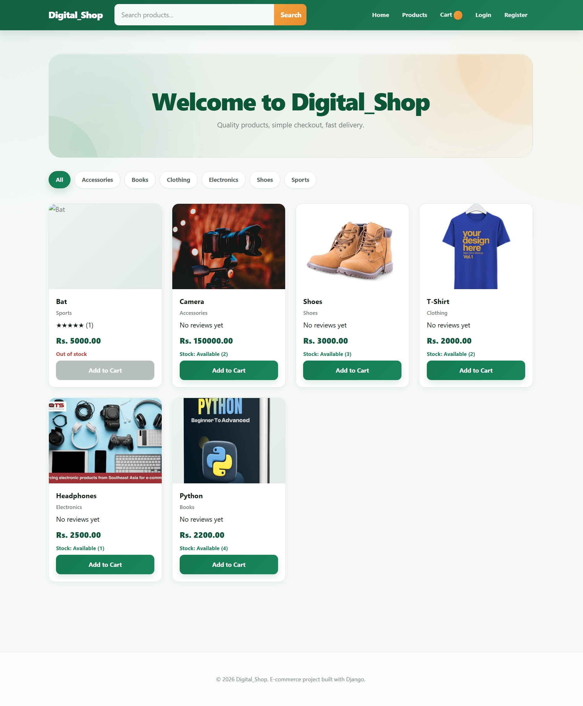
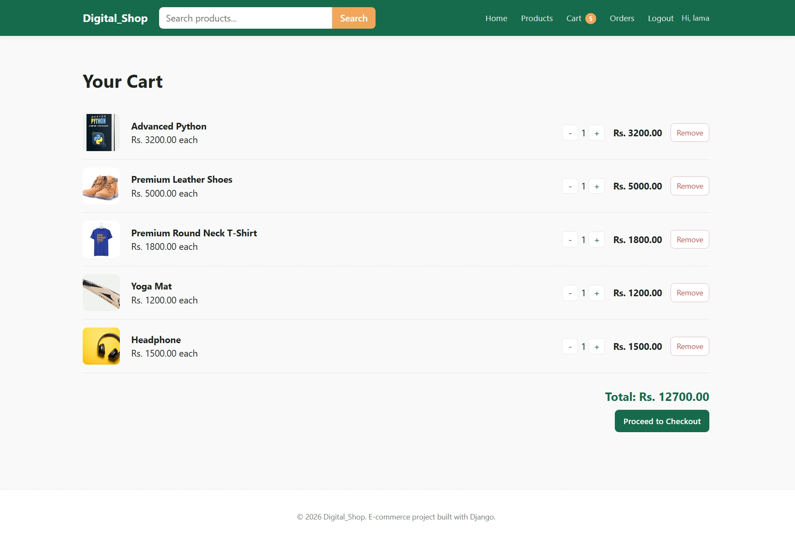
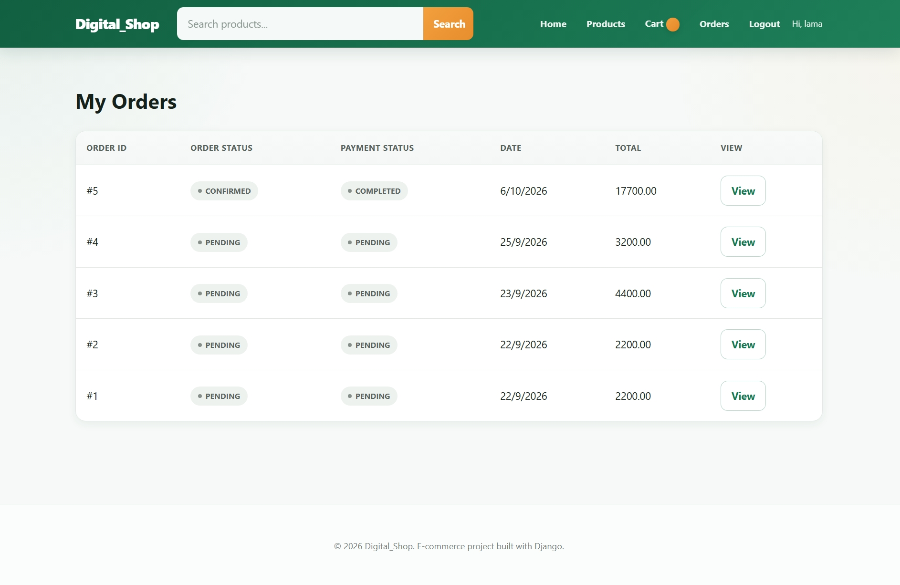
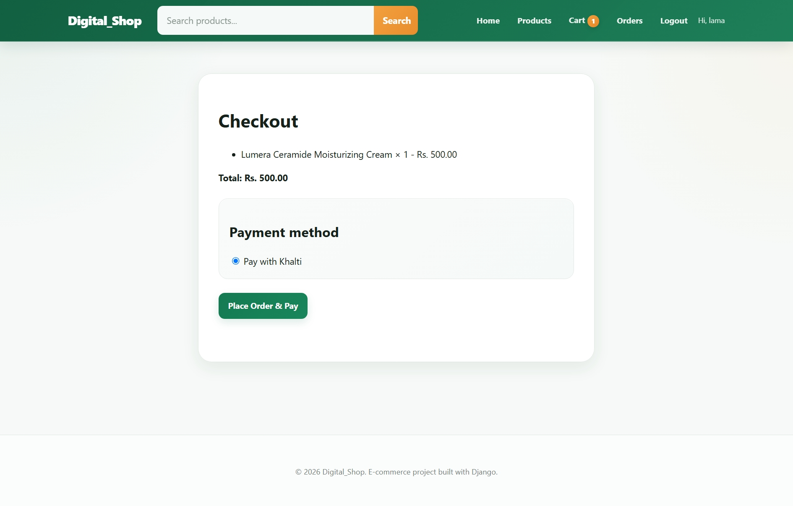
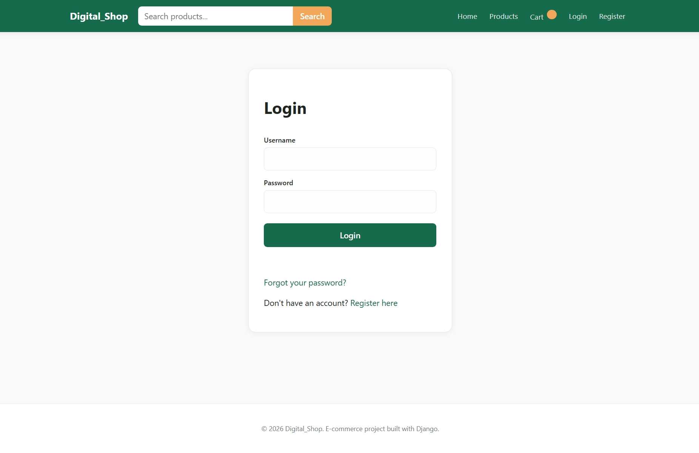

# Digital_Shop

A portfolio-quality, full-stack e-commerce web application built with **Django** and **Django REST Framework**, using server-rendered HTML templates and vanilla JavaScript for the frontend, SQLite for database, and **Khalti** for payments.

## Description

Digital_Shop lets a visitor browse products, search and filter by category, register/login, manage a shopping cart, place orders, and pay via the Khalti payment gateway. The backend exposes a clean, well-separated REST API (each app owns its own `api/` package) while Django templates + vanilla JS serve the whole frontend.

## Features

- User registration, login, logout, and "current user" endpoint using JWT authentication
- Product catalog with categories, search, category filtering, and pagination
- Per-user shopping cart with add / increase / decrease / remove, server-computed subtotals and totals
- Order placement that snapshots prices, validates stock, and updates inventory atomically
- Khalti ePayment integration: payment initiation and **backend-verified** payment confirmation
- Django Admin configured for all models with search, filters, and read-only audit fields
- Responsive, dependency-free HTML/CSS/JS frontend
- Automated tests for accounts, products, cart, orders, and payments

## Tech Stack

- Python, Django, Django REST Framework
- SQLite
- HTML5, CSS3, Vanilla JavaScript (fetch API)
- Pillow (image handling)
- djangorestframework-simplejwt (JWT authentication)
- django-cors-headers, django-filter
- Khalti Epayment API (v2)

## Project Structure

```
Digital_Shop/
├── ecommerce/          # Project settings, root URLs, WSGI/ASGI
├── accounts/           # Registration/login/logout/me (uses Django's User model)
│   └── api/            # serializers.py, views.py, urls.py
├── products/           # Category & Product models + catalog API
│   └── api/
├── cart/                # Cart & CartItem models + cart API
│   └── api/
├── orders/              # Order & OrderItem models + order-creation API
│   └── api/
├── payments/            # Payment model + Khalti initiate/verify API
│   └── api/
├── templates/            # Django templates (base + 9 pages)
├── static/
│   ├── css/style.css
│   └── js/{main,auth,products,cart,checkout}.js
├── media/products/       # Uploaded product images (created at runtime)
└── db.sqlite3
```

Every app keeps its REST code inside its own `api/` package (`products/api/views.py`, not `products/views.py`), while `views.py` at the app root only serves the HTML page shells.

## Installation

1. Install [uv](https://docs.astral.sh/uv/) if you haven't already.

2. Install project dependencies:

   ```bash
   uv sync

   ```
   
## Environment Variables

Set these in a `.env` file (see `.env.example`); `settings.py` loads them via `python-dotenv` if it's installed, or you can export them directly in your shell.

| Variable | Purpose |
|---|---|
| `SECRET_KEY` | Django's cryptographic secret key |
| `DEBUG` | `True`/`False` |
| `ALLOWED_HOSTS` | Comma-separated hostnames |
| `CORS_ALLOWED_ORIGINS` | Comma-separated allowed origins |
| `KHALTI_SECRET_KEY` | Your Khalti merchant secret key (**server-side only**, never sent to the browser) |
| `KHALTI_BASE_URL` | Khalti API base (sandbox by default: `https://dev.khalti.com/api/v2`) |
| `KHALTI_RETURN_URL` | URL Khalti redirects the customer back to after payment (defaults to the checkout page) |

## API Endpoints

**Auth**
- `POST /api/auth/register/`
- `POST /api/auth/login/` (returns `access` + `refresh` JWTs)
- `POST /api/auth/login/refresh/`
- `POST /api/auth/logout/` (blacklists the refresh token)
- `GET  /api/auth/me/`

**Products**
- `GET /api/products/` (`?search=`, `?category=<slug>`, paginated)
- `GET /api/products/<id>/`
- `GET /api/categories/`

**Cart** (authenticated)
- `GET    /api/cart/`
- `POST   /api/cart/` (`{product_id, quantity}`)
- `PATCH  /api/cart/items/<id>/` (`{quantity}`)
- `DELETE /api/cart/items/<id>/`

**Orders** (authenticated)
- `GET  /api/orders/`
- `POST /api/orders/` (builds an order from the current cart)
- `GET  /api/orders/<id>/`

**Payments** (authenticated)
- `POST /api/payments/khalti/initiate/` (`{order_id}` → `{payment_url, pidx}`)
- `POST /api/payments/khalti/verify/` (`{pidx}` — always re-checked against Khalti on the backend)

### How the frontend handles the JWT

On login/register, the frontend stores `access` and `refresh` tokens in `localStorage` (see `static/js/main.js`). Every API call attaches `Authorization: Bearer <access>`; on a `401`, the JS transparently calls the refresh endpoint once and retries. Logout blacklists the refresh token server-side and clears `localStorage`.

## Khalti Setup

1. Create a Khalti **test/merchant** account and copy your test **secret key**.
2. Put it in `.env` as `KHALTI_SECRET_KEY` (never hardcode it, never send it to JavaScript).
3. The checkout flow is:
   `Frontend → POST /api/payments/khalti/initiate/ → Django calls Khalti → redirect user to payment_url → Khalti redirects back to KHALTI_RETURN_URL with ?pidx=... → Frontend calls POST /api/payments/khalti/verify/ → Django looks the pidx up directly with Khalti → Payment + Order updated only on a backend-confirmed "Completed" status.`
4. The frontend never marks anything as paid on its own — it only reflects whatever the verify endpoint returns.

**Limitation:** actually completing a payment requires real Khalti test credentials and going through Khalti's hosted checkout, which cannot be exercised in an offline/sandboxed environment. The `initiate`/`verify` endpoints are fully implemented and covered by tests that mock Khalti's HTTP responses, but an end-to-end payment has not been run against the live Khalti sandbox as part of this build.

## Admin

Visit **http://127.0.0.1:8000/admin/** and log in with the superuser you created. Category, Product, Cart, CartItem, Order, OrderItem, and Payment are all registered with search, filters, and sensible read-only fields.

## Screenshots

### Dashboard



### Carts



### My Orders



### Checkout



### Login



```
## License

This project is licensed under the MIT License. See the [LICENSE](LICENSE) file for details.

---
